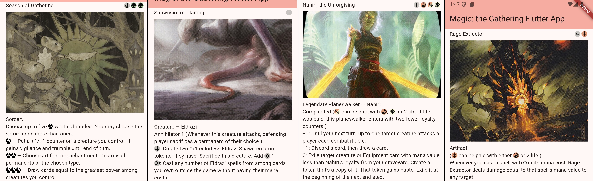
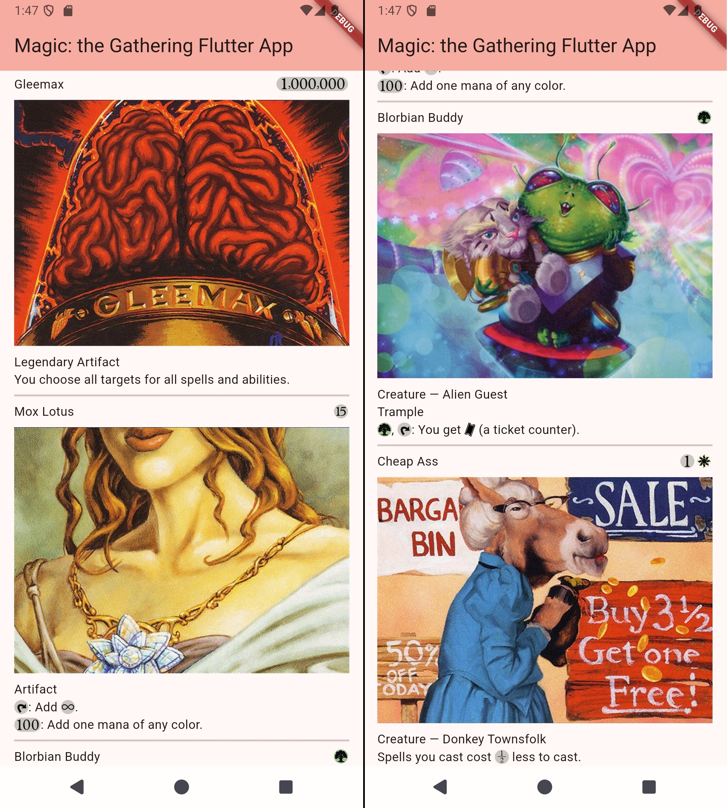

Make developing Magic: The Gathering (MTG) apps a breeze!

## Examples

Develop custom MTG Flutter widgets easily with full support for MTG mana and other symbols:



Full support for "Un" sets as well:



## Features

* Model representing an MTG card
* Double-faced card support
* Convert JSON to models
* SVGs for all MTG symbols and helpful methods to display them
* Minimal external dependencies - only [flutter_svg](https://pub.dev/packages/flutter_svg) and [equatable](https://pub.dev/packages/equatable) are used
* Works on Android, iOS, Linux, MacOS, Web, Windows

## Getting started

You will need to provide data for the MTG cards yourself. Consider downloading or requesting some using the [Scryfall API](https://scryfall.com/docs/api) (which this package is fully interoperable with)!

Then create an MTGCard object and display it using any custom widget you create:

```dart
  @override
  Widget build(BuildContext context) {
    final blackLotus = MTGCard.fromMap({
      "keywords": [],
      "lang": "en",
      "rarity": "bonus",
      "released_at": "2014-06-16",
      "reserved": true,
      "set": "vma",
      "set_name": "Vintage Masters",
      "artist": "Chris Rahn",
      "image_uris": {
        "art_crop":
            "https://cards.scryfall.io/art_crop/front/b/d/bd8fa327-dd41-4737-8f19-2cf5eb1f7cdd.jpg?1614638838",
      },
      "mana_cost": "{0}",
      "cmc": 0.0,
      "name": "Black Lotus",
      "oracle_text":
          "{T}, Sacrifice Black Lotus: Add three mana of any one color.",
      "type_line": "Artifact",
    });
    final cardImage = blackLotus.images?['art_crop'];
    final child = Column(
      crossAxisAlignment: CrossAxisAlignment.start,
      children: [
        Row(
          children: [
            Text(blackLotus.name),
            const Spacer(),
            ...?blackLotus.preparedManaCost(),
          ],
        ),
        const SizedBox(height: 8.0),
        if (cardImage != null) Image.network(cardImage),
        const SizedBox(height: 8.0),
        Text(blackLotus.typeLine),
        Text.rich(blackLotus.preparedOracleText() ??
            TextSpan(text: blackLotus.oracleText)),
      ],
    );
    return Scaffold(
      appBar: AppBar(
        backgroundColor: Theme.of(context).colorScheme.inversePrimary,
        title: Text('Magic: the Gathering Flutter App'),
      ),
      body: SafeArea(
        child: Center(child: child),
      ),
    );
  }
```
